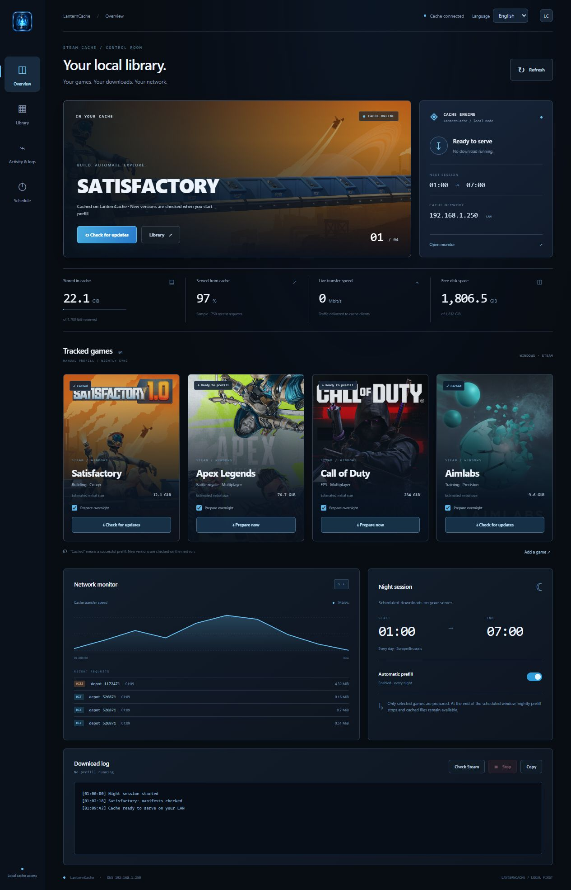
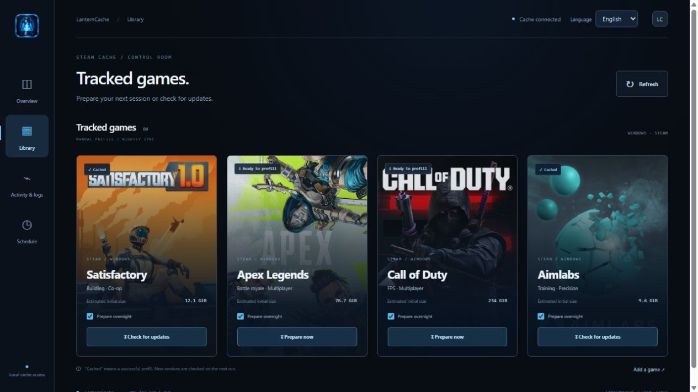
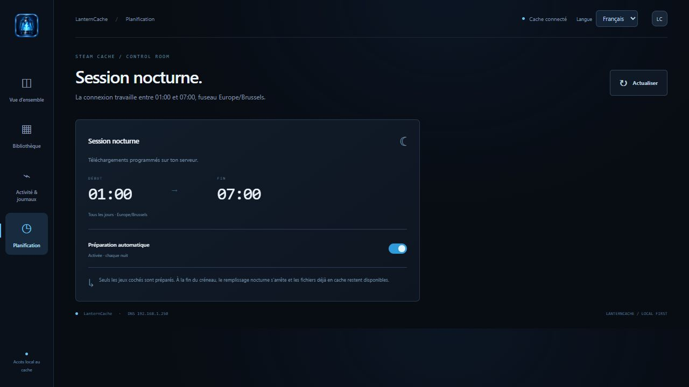

# LanternCache


A local dashboard for Steam downloads, powered by [LanCache](https://lancache.net/) and [SteamPrefill](https://github.com/tpill90/steam-lancache-prefill). Prepare your games overnight, inspect your cache, and control downloads from one browser tab.

LanternCache is an independent application. It uses upstream LanCache and SteamPrefill containers; it is not a fork of either project and is not affiliated with Valve.

## Screenshots

Real interface captures using example network details and demonstration activity. English and French are included by default.



<details>
<summary>Game library and French night schedule</summary>





</details>

The [app icon](assets/lanterncache-icon.png) is also used in the sidebar and as the browser favicon. See [branding notes](docs/BRANDING.md).

## Features

- Steam-inspired game library with live download activity and logs.
- Start a game, check its manifests, or stop downloads while retaining cached files.
- Select games for overnight preparation, with a configurable timezone and time window.
- Storage usage, recent cache requests, sampled cache-hit bytes, and completed-response throughput.
- English and French interface; contributions for other languages are welcome.
- Docker Compose installation on Linux, with optional `lanterncache.local` discovery.

## Install

Browse the [documentation wiki](https://github.com/timiliris/lanterncache/wiki), including the [French guide](https://github.com/timiliris/lanterncache/wiki/Guide-francais), configuration reference and troubleshooting pages. Wiki sources live in `docs/wiki/` for contributions.

See [the complete installation guide](docs/INSTALL.md). The default stack gives LanCache a dedicated LAN IP and publishes the dashboard on a separate server port. Docker Engine on Linux is required; Docker Desktop is not the installation target.

```sh
git clone https://github.com/timiliris/lanterncache.git
cd lanterncache
cp .env.example .env
# Edit the example: network interface, IPs, absolute storage paths, origins and timezone.
docker compose config --quiet
docker compose --profile tools pull cache dns prefill
docker compose up -d --build cache dns ui
docker compose run --rm prefill select-apps
```

Steam authentication and Steam Guard happen in your terminal. The browser never asks for your Steam password. Configure client DNS as described in the installation guide: opening the dashboard alone does not activate caching on your PC.

The initial dashboard includes Satisfactory, Apex Legends, Call of Duty and Aimlabs. SteamPrefill can select other games for overnight preparation; adding their cards and individual controls currently requires extending the game catalog in `server.py` and the translation catalogs.

## Private-network access

Anyone who can reach the dashboard can control downloads. The Docker installation mounts the Docker socket, granting the application control over containers and potentially the host. Keep it on a trusted LAN or behind a private VPN with access controls. It is not designed for direct public Internet exposure. CSRF tokens and origin checks protect browser actions but do not authenticate users.

## Understanding the numbers

Hit ratio describes bytes in a recent sample of successful HTTP responses, not lifetime totals. Throughput counts completed responses and may spike when a large response finishes. A previously filled depot is historical information, not proof the latest update is cached. SteamPrefill checks the current version during preparation. The first download of content still uses your Internet connection.

SteamPrefill requires a Steam account with access to the selected games. LanternCache cannot remove ownership requirements, cache arbitrary encrypted HTTPS traffic, or guarantee that every platform download uses a cache-compatible endpoint.

## Contribute

- [Add or improve a translation](TRANSLATIONS.md).
- Report issues with your Linux version, Docker version, redacted logs, and reproduction steps.
- Never include `.env`, `account.config`, account tokens, private network details, or game content in issues or pull requests.

Original application code is licensed under [MIT](LICENSE). Third-party images, game artwork, trademarks, and dependencies retain their own rights and licenses. Game artwork is loaded from Valve's CDN at runtime; interface screenshots include it for demonstration. Original game artwork files are not bundled with the app.

## Development checks

```sh
python -m unittest discover -s tests -v
python scripts/check-translations.py
node scripts/test-i18n.cjs
docker compose --env-file .env.example config --quiet
```

Run installation checks on the intended Linux host with `python3 scripts/check-install.py`. See [the access and security model](docs/SECURITY.md) before changing network exposure.
